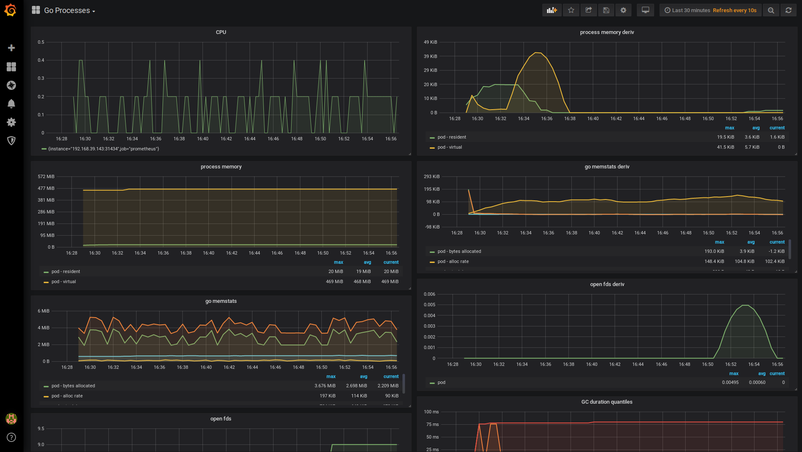

# Talend Vault Sidecar Injector

- [Talend Vault Sidecar Injector](#talend-vault-sidecar-injector)
  - [TL;DR](#tldr)
  - [Introduction](#introduction)
  - [Prerequisites](#prerequisites)
    - [Docker Registry secret](#docker-registry-secret)
    - [Tiller installation](#tiller-installation)
  - [Testing the chart](#testing-the-chart)
  - [Installing the chart](#installing-the-chart)
    - [Installing the chart in a dev environment](#installing-the-chart-in-a-dev-environment)
  - [Uninstalling the chart](#uninstalling-the-chart)
  - [Configuration](#configuration)
  - [Metrics](#metrics)
  - [Annotations](#annotations)
  - [Consul Template's template](#consul-templates-template)
  - [How to invoke Talend Vault Sidecar Injector](#how-to-invoke-talend-vault-sidecar-injector)
    - [General requirements](#general-requirements)
    - [Specific requirements with K8S Jobs](#specific-requirements-with-k8s-jobs)
    - [Examples](#examples)
      - [Usage with a K8S Deployment workload](#usage-with-a-k8s-deployment-workload)
      - [Usage with a K8S Job workload](#usage-with-a-k8s-job-workload)
      - [Custom secrets path and notification command](#custom-secrets-path-and-notification-command)
      - [Ask for secrets hook injection, custom secrets file and template](#ask-for-secrets-hook-injection-custom-secrets-file-and-template)
      - [Ask for secrets hook injection, several custom secrets files and templates](#ask-for-secrets-hook-injection-several-custom-secrets-files-and-templates)

## TL;DR

`Talend Vault Sidecar Injector` is a special component in that it is not a Talend business service nor really a technical service but can be more accurately described as a Kubernetes admission controller plugin. It consists in a **Webhook Admission Server**, registered in the Kubernetes Mutating Admission Webhook Controller, that will mutate resources depending on defined criteriae. See here for more details: <https://kubernetes.io/docs/reference/access-authn-authz/extensible-admission-controllers/#admission-webhooks>.

In our case, this component allows us to dynamically inject both Vault Agent and Consul Template containers as sidecars (along with configuration and volumes) in any matching pod manifest. Pods willing to benefit from Vault to handle their secrets just have to add some custom annotations to ask for the sidecars injection at deployment time.

A Helm chart for `Talend Vault Sidecar Injector` is provided under [deploy/helm](deploy/helm) folder and can be installed on your Kubernetes cluster using following command:

```bash
$ helm install <chart_folder_location>
```

> ⚠️ **Important note** ⚠️: support for sidecars in Kubernetes **jobs** suffers from limitations and issues exposed here: <https://github.com/kubernetes/kubernetes/issues/25908>. Same issues/limitations exist with Istio service mesh.
>
> A Kubernetes proposal tries to address those points: <https://github.com/kubernetes/enhancements/blob/master/keps/sig-apps/sidecarcontainers.md>, <https://github.com/kubernetes/enhancements/issues/753>. Implementation of the proposal has started and should be released in Kubernetes 1.16 (in Alpha stage).
>
> In the meantime however, `Talend Vault Sidecar Injector` implements specific sidecar and signaling mechanism to properly stop all injected containers on job termination.

## Introduction

This chart is intended to be deployed in a "system" namespace (`admin`) and only once as it handles all injection requests from any pods deployed in any namespaces. **It *shall not* be deployed in every namespaces**.

>**Note**: it is possible to deploy an instance in a given namespace **and to restrict injection to this same namespace** if necessary, **in particular in a dev environment where each team wants its own instance of `Talend Vault Sidecar Injector` for testing purpose** with its dedicated configuration (including a dedicated Vault server). Refer to section [Installing the chart in a dev environment](#Installing-the-chart-in-a-dev-environment) below.

## Prerequisites

Installation:

- Kubernetes v1.10+
- Tiller & Helm client

Runtime:

- Vault server started
- Vault server reachable through Kubernetes service & endpoint deployed into cluster

### Docker Registry secret

You need to provision Talend Docker Registry secret in **each namespace** where you intend to install this chart:

```bash
kubectl create secret docker-registry talend-registry --docker-server=artifactory.datapwn.com --docker-username=<you user name> --docker-password="<your password>" --docker-email=<your email> -n <namespace>
```

> Note: as `Talend Vault Sidecar Injector` is meant to be deployed in the `admin` namespace, do not forget to create the Docker registry secret in this namespace.

### Tiller installation

Install Tiller using a service account:

```bash
$ cat <<EOF | kubectl apply -f -
apiVersion: v1
kind: ServiceAccount
metadata:
  name: tiller
  namespace: kube-system
---
apiVersion: rbac.authorization.k8s.io/v1
kind: ClusterRoleBinding
metadata:
  name: tiller
roleRef:
  apiGroup: rbac.authorization.k8s.io
  kind: ClusterRole
  name: cluster-admin
subjects:
- kind: ServiceAccount
  name: tiller
  namespace: kube-system
EOF

$ helm init --service-account tiller
```

For details on using Tiller with RBAC:

- <https://helm.sh/docs/using_helm/#tiller-and-user-permissions>
- <https://helm.sh/docs/using_helm/#tiller-and-role-based-access-control>

## Testing the chart

> **Note:** as `Talend Vault Sidecar Injector` chart makes use of Helm post-install hooks, **do not** provide Helm `--wait` flag since it will prevent post-install hooks from running and installation will fail.

```bash
$ helm install <chart_folder_location> --name vault-sidecar-injector --debug --dry-run

$ helm install <chart_folder_location> --name vault-sidecar-injector --debug
```

## Installing the chart

To install the chart with the release name vault-sidecar-injector on your local k8s cluster you need to:

```bash
$ helm install --name vault-sidecar-injector <chart_folder_location> --namespace admin
```

or from Helm registry:

```bash
$ helm install --name vault-sidecar-injector talend/talend-vault-sidecar-injector --version <chart_version> --namespace admin
```

To install the chart on the Talend k8s cluster you also need to set the Tiller namespace and the application namespace. You can do this with one of the following two commands:

```bash
$ TILLER_NAMESPACE=admin helm install --name vault-sidecar-injector <chart_folder_location> --namespace admin

$ helm install --name vault-sidecar-injector <chart_folder_location> --namespace admin --tiller-namespace admin
```

> **Note:** `Talend Vault Sidecar Injector` should be deployed only once (except for testing purpose, see below). It will mutate any "vault-sidecar annotated" pod from any namespace.

The command deploys the `Talend Vault Sidecar Injector` service on the Kubernetes cluster in the default configuration. The [configuration](#configuration) section lists the parameters that can be configured during installation.

### Installing the chart in a dev environment

In a dev environment, you may want to install your own instance of `Talend Vault Sidecar Injector`, connected to your own Vault server and limiting injection to your namespace. To do so, use following options:

```bash
$ helm install --name vault-sidecar-injector <chart_folder_location> --namespace <your namespace> --tiller-namespace <your namespace> --set mutatingwebhook.namespaceSelector.namespaced=true --set vault.addr=<your Vault server>
```

or from Helm registry:

```bash
$ helm install --name vault-sidecar-injector talend/talend-vault-sidecar-injector --version <chart_version> --namespace <your namespace> --tiller-namespace <your namespace> --set mutatingwebhook.namespaceSelector.namespaced=true --set vault.addr=<your Vault server>
```

And then **add a label on your namespace** as follows (if not done, no injection will be performed):

```bash
$ kubectl label namespace <your namespace> vault-injection=<your namespace> --overwrite

# check label is set
$ kubectl get namespace -L vault-injection
```

## Uninstalling the chart

To uninstall/delete the `Talend Vault Sidecar Injector` deployment:

```bash
$ helm delete --purge vault-sidecar-injector
```

> Note If you encounter issues trying to uninstall the chart, try option `--no-hooks` then remove remaining parts with kubectl cli.

This command removes all the Kubernetes components associated with the chart and deletes the release.

## Configuration

The following tables lists the configurable parameters of the `Talend Vault Sidecar Injector` chart and their default values.

| Parameter    | Description          | Default                                                         |
|:------------------------------------------------|:-------------------------------------------------------------------------------------------------------------------------------------|:----------------------------------------------------------------|
| hook.image.path            | the Docker image path in the registry | talend/common/tsbi/kube-base |
| hook.image.pullPolicy      | pullPolicy defines the pull policy for docker images: IfNotPresent or Always | IfNotPresent |
| image.applicationNameLabel   | applicationNameLabel represents the Talend Application Name and it must match the label com.talend.application from the docker image | talend-vault-sidecar-injector                                   |
| image.metricsPort                | metricsPort defines the port exposed by the docker image for metrics collection | 9000 |
| image.path       | the Docker image path in the registry   | talend/common/tsbi/k8s/vault-sidecar-injector |
| image.port       | service main port exposed by the docker image   | 8443                                                             |
| image.pullPolicy   | pullPolicy defines the pull policy for docker images: IfNotPresent or Always       | IfNotPresent           |
| image.serviceNameLabel   | serviceNameLabel represents the Talend Service Name and it must match the label com.talend.service from the docker image             | talend-vault-sidecar-injector                                   |
| image.tag  | tag defines the version/tag of the docker image     | 1.7.1-20190828131916                                           |
| injectconfig.consultemplate.image.path   | the Docker image path in the registry (including registry name)   | hashicorp/consul-template    |
| injectconfig.consultemplate.image.pullPolicy   | pullPolicy defines the pull policy for docker images: IfNotPresent or Always  | IfNotPresent    |
| injectconfig.consultemplate.image.tag          | tag defines the version/tag of the docker image   | 0.22.0-alpine       |
| injectconfig.consultemplate.loglevel           | Consul Template log level: trace, debug, info, warn, err   | info       |
| injectconfig.consultemplate.resources.limits.cpu | Consul Template sidecar CPU resource limits | 20m |
| injectconfig.consultemplate.resources.limits.memory | Consul Template sidecar memory resource limits | 25Mi |
| injectconfig.consultemplate.resources.requests.cpu | Consul Template sidecar CPU resource requests | 10m |
| injectconfig.consultemplate.resources.requests.memory | Consul Template sidecar memory resource requests | 15Mi |
| injectconfig.jobbabysitter.image.path   | the Docker image path in the registry | talend/common/tsbi/centos-base |
| injectconfig.jobbabysitter.image.pullPolicy | pullPolicy defines the pull policy for docker images: IfNotPresent or Always | IfNotPresent |
| injectconfig.jobbabysitter.resources.limits.cpu | Vault sidecar CPU resource limits | 20m |
| injectconfig.jobbabysitter.resources.limits.memory | Vault sidecar memory resource limits | 25Mi |
| injectconfig.jobbabysitter.resources.requests.cpu | Vault sidecar CPU resource requests | 15m |
| injectconfig.jobbabysitter.resources.requests.memory | Vault sidecar memory resource requests | 20Mi |
| injectconfig.vault.image.path  | the Docker image path in the registry  | talend/common/tsbi/vault |
| injectconfig.vault.image.pullPolicy    | pullPolicy defines the pull policy for docker images: IfNotPresent or Always  | IfNotPresent   |
| injectconfig.vault.loglevel                    | Vault log level: trace, debug, info, warn, err    | info    |
| injectconfig.vault.resources.limits.cpu | Vault sidecar CPU resource limits | 30m |
| injectconfig.vault.resources.limits.memory | Vault sidecar memory resource limits | 25Mi |
| injectconfig.vault.resources.requests.cpu | Vault sidecar CPU resource requests | 30m |
| injectconfig.vault.resources.requests.memory | Vault sidecar memory resource requests | 20Mi |
| mutatingwebhook.annotations.appLabelKey | annotation for application's name. Annotation's value used as Vault role by default. | com.talend.application  |
| mutatingwebhook.annotations.appServiceLabelKey | annotation for service's name | com.talend.service  |
| mutatingwebhook.annotations.keyPrefix | prefix used for all vault sidecar injector annotations | sidecar.vault.talend.org  |
| mutatingwebhook.failurePolicy | defines how unrecognized errors and timeout errors from the admission webhook are handled. Allowed values are Ignore or Fail | Ignore |
| mutatingwebhook.namespaceSelector.boolean    | Enable to control, with label "vault-injection=enabled", the namespaces where injection is allowed (if false: all namespaces except _kube-system_ and _kube-public_) | false                                                           |
| mutatingwebhook.namespaceSelector.namespaced | Enable to control, with label "vault-injection={{ .Release.Namespace }}", the specific namespace where injection is allowed (ie, restrict to namespace where injector is installed) | false |
| probes.liveness.failureThreshold                | Number of probe failure before restarting the probe                                                                                  | 3                                                               |
| probes.liveness.initialDelaySeconds             | Number of seconds after the container has started before the probe is initiated                                                      | 2                                                              |
| probes.liveness.periodSeconds                   | How often (in seconds) to perform the probe                                                                                          | 20                                                              |
| probes.liveness.timeoutSeconds                  | Number of seconds after which the probe times out                                                                                    | 5                                                               |
| probes.readiness.failureThreshold               | Number of probe failure before setting the probe to Unready                                                                          | 3                                                               |
| probes.readiness.initialDelaySeconds            | Number of seconds after the container has started before the probe is initiated                                                      | 2                                                              |
| probes.readiness.periodSeconds                  | How often (in seconds) to perform the probe                                                                                          | 20                                                              |
| probes.readiness.successThreshold               | Minimum consecutive successes for the probe to be considered successful after having failed                                          | 1                                                               |
| probes.readiness.timeoutSeconds                 | Number of seconds after which the probe times out                                                                                    | 5                                                               |
| rbac.install                         | create RBAC resources. Must be set for any cluster configured with rbac. | true |
| registryKey         | registryKey is a k8s secret for Docker images.                               | talend-registry |
| replicaCount                                    | replicaCount defines the number of container replicas running in parallel                                                            | 3                                                               |
| resources.limits.cpu                            | CPU resource limits                                                                                                                  | 250m                                                            |
| resources.limits.memory                         | Memory resource limits                                                                                                               | 256Mi                                                           |
| resources.requests.cpu                          | CPU resource requests                                                                                                                | 100m                                                            |
| resources.requests.memory                       | Memory resource requests                                                                                                             | 128Mi                                                           |
| revisionHistoryLimit                            | revision history limit in tiller / helm / k8s                                                                                        | 3                                                               |
| service.exposedServicePort                      | exposedServicePort is the port exposed by the K8s service (Kubernetes always assumes port 443 for webhooks)                       | 443                                                             |
| service.name                                    | service name                                                                                                                         | talend-vault-sidecar-injector                                   |
| service.prefixWithHelmRelease                   | prefixWithHelmRelease defines whether the service name will be prefixed with Helm release name                                       | false                                                           |
| service.type                                    | type is the Kubernetes service type: ClusterIP, NodePort, LoadBalancer, ExternalName                                                 | ClusterIP                                                       |
| talendImageRegistry  | talendImageRegistry is Talend's Docker registry host name | artifactory.datapwn.com/tlnd-docker-dev  |
| vault.addr                                      | Address of Vault server                                                                                                              | https://vault:8200                                               |
| vault.authMethods.approle.roleid_filename    | Filename for role id    | approle_roleid   |
| vault.authMethods.approle.secretid_filename  | Filename for secret id  | approle_secretid |
| vault.authMethods.kubernetes.path      | Path defined for Kubernetes Auth Method            | kubernetes |
| vault.ssl.enabled              | Enable or disable secure connection with Vault server               | true |
| vault.ssl.verify               | Enable or disable verification of certificates               | true |

You can override these values at runtime using the `--set key=value[,key=value]` argument to `helm install`. For example,

```bash
$ helm install --name vault-sidecar-injector \
               --set <parameter1>=<value1>,<parameter2>=<value2> \
                <chart_folder_location>
```

> Example, to skip certificates verification when testing locally:
>
> `helm install --name vault-sidecar-injector talend/talend-vault-sidecar-injector --version <chart_version> --namespace admin --set vault.ssl.verify=false`

Alternatively, a YAML file that specifies the values for the parameters can be provided while installing the chart. For example,

```bash
$ helm install --name <release_name> -f <path>/values-standalone.yaml  <chart_folder_location>
```

> **Tip**: You can use the default [values.yaml](values.yaml)

## Metrics

Talend Vault Sidecar Injector exposes a Prometheus endpoint at `/metrics` on port `metricsPort` (default: 9000).

Following collectors are available:

- Process Collector
  - process_cpu_seconds_total
  - process_virtual_memory_bytes
  - process_start_time_seconds
  - process_open_fds
  - process_max_fds
- Go Collector
  - go_goroutines
  - go_threads
  - go_gc_duration_seconds
  - go_info
  - go_memstats_alloc_bytes
  - go_memstats_heap_alloc_bytes
  - go_memstats_alloc_bytes_total
  - go_memstats_sys_bytes
  - go_memstats_lookups_total
  - ...



## Annotations

Following annotations in requesting pods are supported:

| Annotation                            | (M)andatory / (O)ptional | Default Value        | Supported Values               | Description |
|---------------------------------------|------------------------|--------------------|------------------------------------|-------------|
| `sidecar.vault.talend.org/inject`     | M                      |         | "true" / "on" / "yes" / "y"    | Ask for sidecar injection to get secrets from Vault    |
| `sidecar.vault.talend.org/auth`       | O                      | "kubernetes"   | "kubernetes" / "approle" | Vault Auth Method to use |
| `sidecar.vault.talend.org/workload`   | O                      |  | "job" | Type of submitted workload |
| `sidecar.vault.talend.org/role`       | O                      | "\<`com.talend.application` label\>" | Any string    | Vault role associated to requesting pod  |
| `sidecar.vault.talend.org/sa-token`   | O                      | "/var/run/secrets/kubernetes.io/serviceaccount/token" | Any string | Full path to service account token used for Vault Kubernetes authentication |
| `sidecar.vault.talend.org/secrets-path`        | O                      | "secret/<`com.talend.application` label>/<`com.talend.service` label>" | Comma-separated strings | List of secrets engines and path      |
| `sidecar.vault.talend.org/secrets-destination` | O                      | "secrets.properties" | Comma-separated strings  | List of secrets filenames (without path), one per secrets path |
| `sidecar.vault.talend.org/secrets-hook` | O |  | "true" / "on" / "yes" / "y" | If set, lifecycle hooks will be added to pod's container(s) to wait for secrets files |
| `sidecar.vault.talend.org/secrets-template` | O | Default template *(see below)* | Comma-separated Consul Template templates | Allow to override default Consul Template's template. Ignore `sidecar.vault.talend.org/secrets-path` annotation if set |
| `sidecar.vault.talend.org/notify`              | O                      | ""   | Comma-separated strings  | List of commands to notify application/service of secrets change, one per secrets path |

Upon successful injection, Talend Vault Sidecar Injector will add annotation(s) to the requesting pods:

| Annotation                        | Value      | Description                                 |
|-----------------------------------|------------|---------------------------------------------|
| `sidecar.vault.talend.org/status` | "injected" | Status set by Talend Vault Sidecar Injector |

## Consul Template's template

Default template below is generic (fetch all secrets and create key/value pairs) and should be ok for most use cases:

```ct
{{ with secret "<APPSVC_VAULT_SECRETS_PATH>" }}{{ range \$k, \$v := .Data }}
{{ \$k }}={{ \$v }}
{{ end }}{{ end }}
```

Using annotation `sidecar.vault.talend.org/secrets-template` it is nevertheless possible to provide your own list of templates. For some examples have a look at the next section.

Details on template syntax:

- <https://github.com/hashicorp/consul-template#secret>
- <https://github.com/hashicorp/consul-template#secrets>
- <https://github.com/hashicorp/consul-template#helper-functions>

## How to invoke Talend Vault Sidecar Injector

### General requirements

- **use of `imagePullSecrets` attribute** with value `talend-registry`, for being able to pull TSBI-based sidecars

### Specific requirements with K8S Jobs

- **use of `serviceAccountName` attribute**, with role allowing to perform GET on pods (needed to poll for job's pod status)
- **to not make use of annotation `sidecar.vault.talend.org/secrets-hook`** as it will immediately put the job in error state. This hook is meant to be used with deployment workloads only as it forces a restart of the application container until secrets are available in application's context. With jobs, as we look after status of the job container, our special signaling mechanism will terminate all the sidecars upon job exit thus preventing use of the hook.

### Examples

#### Usage with a K8S Deployment workload

Only mandatory annotation to ask for Vault Agent and Consul Template injection is `sidecar.vault.talend.org/inject`.

It means that, with the provided manifest below:

- Vault authentication done using role `test-app-1` (value of `com.talend.application` label)
- secrets fetched from Vault's path `secret/test-app-1/test-app-1-svc` using default Consul Template's template
- secrets to be stored into `/opt/talend/secrets/secrets.properties`

```yaml
apiVersion: apps/v1
kind: Deployment
metadata:
  name: test-app-1
spec:
  replicas: 1
  selector:
    matchLabels:
      com.talend.application: test-app-1
      com.talend.service: test-app-1-svc
  template:
    metadata:
      annotations:
        sidecar.vault.talend.org/inject: "true"
      labels:
        com.talend.application: test-app-1
        com.talend.service: test-app-1-svc
    spec:
      serviceAccountName: ...
      imagePullSecrets:
        - name: talend-registry
      containers:
        - name: ...
          image: ...
          ...
          volumeMounts:
            - name: secrets
              mountPath: /opt/talend/secrets
      volumes:
        - name: secrets
          emptyDir:
            medium: Memory
```

#### Usage with a K8S Job workload

When submitting a job, annotation `sidecar.vault.talend.org/workload` **must be used with value set to `"job"`**.

The service account used to run the job should at least have the following permissions:

```yaml
apiVersion: v1
kind: ServiceAccount
metadata:
  name: job-sa
  namespace: default
---
kind: Role
apiVersion: rbac.authorization.k8s.io/v1
metadata:
  name: job-pod-status
rules:
  - apiGroups: [""]
    resources: ["pods"]
    verbs: ["get"]
---
kind: RoleBinding
apiVersion: rbac.authorization.k8s.io/v1
metadata:
  name: job-pod-status
subjects:
  - kind: ServiceAccount
    name: job-sa
roleRef:
  apiGroup: rbac.authorization.k8s.io
  kind: Role
  name: job-pod-status
```

Last point is to make sure your job is waiting for availability of secrets file(s) before starting as it can take a couple of seconds before Consul Template sidecar fetches the secrets from the Vault server. A simple polling loop is provided in the sample below.

```yaml
apiVersion: batch/v1
kind: Job
metadata:
  name: test-app-1
  namespace: default
spec:
  backoffLimit: 1
  template:
    metadata:
      annotations:
        sidecar.vault.talend.org/inject: "true"
        sidecar.vault.talend.org/workload: "job"
      labels:
        com.talend.application: test-app-1
        com.talend.service: test-app-1-svc
    spec:
      restartPolicy: Never
      serviceAccountName: job-sa
      imagePullSecrets:
        - name: talend-registry
      containers:
        - name: test-app-1-job-container
          image: busybox:1.28
          command:
            - "sh"
            - "-c"
            - |
              while true; do
                echo "Wait for secrets file before running job..."
                if [ -f "/opt/talend/secrets/secrets.properties" ]; then
                  echo "secrets available"
                  break
                fi
                sleep 2
              done
              echo "Job started"
              (...)
              exit_code=$?
              echo "Job stopped"
              exit $exit_code
          volumeMounts:
            - name: secrets
              mountPath: /opt/talend/secrets
      volumes:
        - name: secrets
          emptyDir:
            medium: Memory
```

#### Custom secrets path and notification command

Several optional annotations to end up with:

- Vault authentication using role `test-app-4` (value of `com.talend.application` label)
- secrets fetched from Vault's path `secret/test-app-4-svc` using default Consul Template's template
- secrets to be stored into `/opt/app/secrets.properties`
- secrets changes trigger notification command `curl localhost:8888/actuator/refresh -d {} -H 'Content-Type: application/json'`

```yaml
apiVersion: apps/v1
kind: Deployment
metadata:
  name: test-app-4
spec:
  replicas: 1
  selector:
    matchLabels:
      com.talend.application: test-app-4
      com.talend.service: test-app-4-svc
  template:
    metadata:
      annotations:
        sidecar.vault.talend.org/inject: "true"
        sidecar.vault.talend.org/secrets-path: "secret/test-app-4-svc"
        sidecar.vault.talend.org/notify: "curl localhost:8888/actuator/refresh -d {} -H 'Content-Type: application/json'"
      labels:
        com.talend.application: test-app-4
        com.talend.service: test-app-4-svc
    spec:
      serviceAccountName: ...
      imagePullSecrets:
        - name: talend-registry
      containers:
        - name: ...
          image: ...
          ...
          volumeMounts:
            - name: secrets
              mountPath: /opt/app
      volumes:
        - name: secrets
          emptyDir:
            medium: Memory
```

#### Ask for secrets hook injection, custom secrets file and template

Several optional annotations to end up with:

- Vault authentication using role `common-dataset` (value of `com.talend.application` label)
- hook injected in application's container(s) to wait for secrets file availability
- secrets fetched from Vault's path `aws/creds/common-dataset` using **one custom Consul Template's template**
- secrets to be stored into `/opt/talend/secrets/creds.properties`

```yaml
apiVersion: apps/v1
kind: Deployment
metadata:
  name: test-app-6
spec:
  replicas: 1
  selector:
    matchLabels:
      com.talend.application: common-dataset
      com.talend.service: test-app-6-svc
  template:
    metadata:
      annotations:
        sidecar.vault.talend.org/inject: "true"
        sidecar.vault.talend.org/secrets-hook: "true"
        sidecar.vault.talend.org/secrets-destination: "creds.properties"
        sidecar.vault.talend.org/secrets-template: |
          {{ with secret "aws/creds/common-dataset" }}
          {{ if .Data.access_key }}
          dataset.local.s3.credentials.accessKey={{ .Data.access_key }}
          dataset.s3.credentials.accessKey={{ .Data.access_key }}
          {{ end }}
          {{ if .Data.secret_key }}
          dataset.local.s3.credentials.secret={{ .Data.secret_key }}
          dataset.s3.credentials.secret={{ .Data.secret_key }}
          {{ end }}
          {{ end }}
      labels:
        com.talend.application: common-dataset
        com.talend.service: test-app-6-svc
    spec:
      serviceAccountName: ...
      imagePullSecrets:
        - name: talend-registry
      containers:
        - name: ...
          image: ...
          ...
          volumeMounts:
            - name: secrets
              mountPath: /opt/talend/secrets
      volumes:
        - name: secrets
          emptyDir:
            medium: Memory
```

#### Ask for secrets hook injection, several custom secrets files and templates

Several optional annotations to end up with:

- Vault authentication using role `test-app-2` (value of `com.talend.application` label)
- hook injected in application's container(s) to wait for secrets file availability
- secrets fetched from Vault's path `secret/test-app-2/test-app-2-svc` using **several custom Consul Template's templates**
- secrets to be stored into `/opt/talend/secrets/secrets.properties` and `/opt/talend/secrets/secrets2.properties`

```yaml
apiVersion: apps/v1
kind: Deployment
metadata:
  name: test-app-2
spec:
  replicas: 1
  selector:
    matchLabels:
      com.talend.application: test-app-2
      com.talend.service: test-app-2-svc
  template:
    metadata:
      annotations:
        sidecar.vault.talend.org/inject: "true"
        sidecar.vault.talend.org/secrets-hook: "true"
        sidecar.vault.talend.org/secrets-destination: "secrets.properties,secrets2.properties"
        sidecar.vault.talend.org/secrets-template: |
          {{ with secret "secret/test-app-2/test-app-2-svc" }}
          {{ if .Data.SECRET1 }}
          my_custom_key_name1={{ .Data.SECRET1 }}
          {{ end }}
          {{ end }},
          {{ with secret "secret/test-app-2/test-app-2-svc" }}
          {{ if .Data.SECRET2 }}
          my_custom_key_name2={{ .Data.SECRET2 }}
          {{ end }}
          {{ end }}
      labels:
        com.talend.application: test-app-2
        com.talend.service: test-app-2-svc
    spec:
      serviceAccountName: ...
      imagePullSecrets:
        - name: talend-registry
      containers:
        - name: ...
          image: ...
          ...
          volumeMounts:
            - name: secrets
              mountPath: /opt/talend/secrets
      volumes:
        - name: secrets
          emptyDir:
            medium: Memory
```
