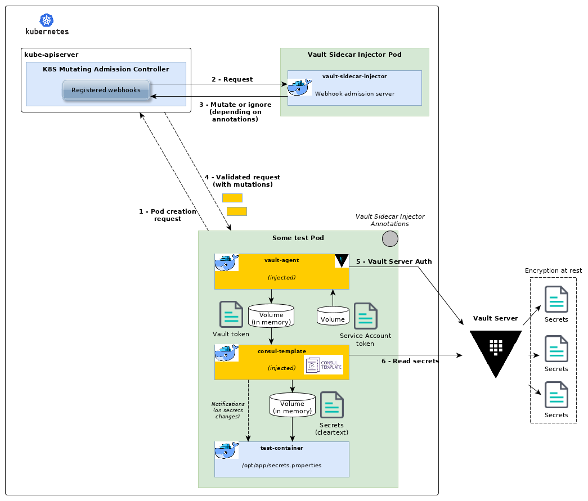

# Leveraging new Vault Agent Template feature

*November 2019, [Post by Alain Saint-Sever, Senior Cloud Software Architect (@alstsever)](https://twitter.com/alstsever)*

Fostering adoption of any open source project is a never ending challenge. Last month first public release was a great step forward but we must keep looking after any means for improvements and meet the needs from the community.

Next v4.0.0 release will bring some nice things to onboard users faster (*docker image available in Docker Hub*, *Helm chart published as a release artifact*) but the main highlight is that it will come with simpler configuration and reduced runtime footprint as we are adopting a new Vault feature: **Vault Agent Template**.

This feature, shipped with Vault 1.3.0, allows to run templates the same way we used Consul Template for fetching secrets. This is a great opportunity: one less container to inject in workloads means less moving parts and latency in the process of getting your secrets ready to consume. As a side note, we also all benefit from a less complex configuration.

`Vault Sidecar Injector` 4.0.0 release and associated Helm chart leverage the new Vault Agent Template feature.

|Before v4.0.0 release|From v4.0.0 release|
|---|---|
|||
