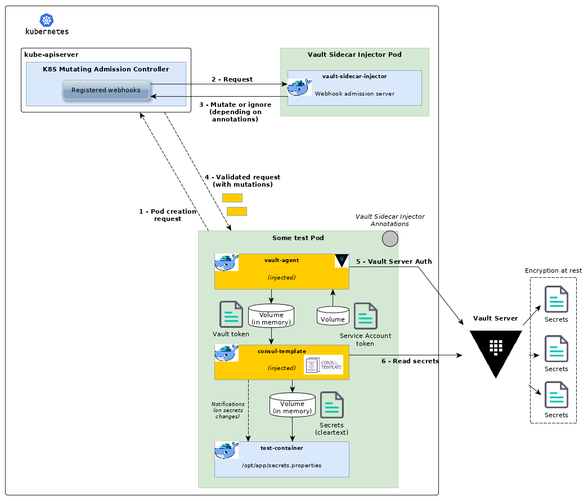

# Open sourcing Vault Sidecar Injector, Talend's Vault-based secrets management solution on Kubernetes

*October 2019, [Post by Alain Saint-Sever, Senior Software Cloud Architect (@alstsever)](https://twitter.com/alstsever)*

Handling secrets has always been a challenging and critical task within organizations. As production workloads deployed in remote clouds or following hybrid patterns are ever increasing, this problematic becomes more complex: we still want to manage secrets from a central place, using state-of-the-art security practices (encryption at rest, secrets rotation), with as less adherence on the underlying technology as possible to maximize components reusability across deployment topologies and ease testability.

Today we are **open sourcing the code of our Vault Sidecar Injector component**. [You can start exploring it on GitHub right now](https://github.com/Talend/vault-sidecar-injector).

With this component we are introducing a secrets management solution relying on sidecars injection and kubernetes admission controller to provide a secure, seamless and dynamic experience.

## Benefits to the Ecosystem

Kubernetes provides an effective but somewhat basic way to handle secrets. By default, encryption at rest is not enabled and advanced key management operations are not available. There is no signaling mechanism either upon any secrets change thus enforcing a file polling pattern on applications willing to use up-to-date credentials. But, paradoxically, the biggest issue may lie in the "Kubernetes-native" nature of this solution: it is not the best candidate in architectures mixing legacy/non-containerized applications with Cloud Native ones. It may also not be a good fit if you want to handle secrets dispatched over a set of Kubernetes clusters.

For organizations looking to centralize secrets management among Kubernetes clusters and traditional applications, it is more relevant to adopt a technology/stack agnostic solution with full-fledged encryption and authentication options.

The Vault Sidecar Injector component allows organizations to securely and continuously fetch and push secrets to applications while still delivering a developer experience on par with Kubernetes Secrets.

## What's wrong with Kubernetes Secrets?

Kubernetes comes with the `Secret` resource to allow secret creation, retrieval, deletion. As a native Kubernetes concept, it is best used to handle secrets for applications lying in the cluster. Containers consuming `Secrets` mounted in a volume will receive updates whenever a change is deployed in the cluster (your application should be designed to be *aware* of secrets rotation).

The secret itself is stored into etcd, the key/value store that also serve as the internal database for all Kubernetes configuration and administration operations.

- *Before Kubernetes 1.7*, secrets were stored in **cleartext** in etcd.
- *From Kubernetes 1.7*, [encryption of secret data at rest is supported](<https://github.com/kubernetes/kubernetes/blob/master/CHANGELOG-1.7.md#encryption-at-rest>) but **not applied by default**. This is still the case with latest Kubernetes version (1.16 as of writing this blog post).

To sum up, Kubernetes Secrets

- offer a Kubernetes native, off-the-shelf, solution for your in-cluster apps **but cannot be leveraged by out-of-cluster apps**
- do not support storing or retrieving secret data **from external secret management systems**
- are not securely stored **by default**
- seamlessly provide access to secrets, in cleartext, to your apps **but without any means to notify about the changes** (however secrets rotation is supported if mounted as a volume)

Using built-in Kubernetes `Secret` resource, unless your security requirements are low, is not a good fit, even more for hybrid deployments. It also **lacks advanced secret management features** (admin console, secrets revocation & renewal, leases ...) and **cannot cope with dynamic secrets** (secrets generated on the fly at read time).

## Introducing Vault Sidecar Injector

At Talend, we are dealing with both on-premise, legacy, applications and cloud applications hosted either in managed or unmanaged environments on multiple cloud providers. The need for a centralized secrets management solution arose early on. Such solution should tick the following boxes:

- same secret infrastructure for both Kubernetes/Cloud-native apps and legacy/non-Kubernetes/on-premises apps
- avoid cloud vendor lock in (no cloud managed secret stores)
- secure storage by design (encryption of data at rest)
- support secrets renewal & revocation operations
- handle dynamic secrets
- administration capabilities
- ... and Kubernetes-ready to be deployed as a service for in-clusters and out-of-clusters apps

Moreover, in order to minimize downtime, cloud-native apps should be alerted of any secrets change in order to have a chance to reload and apply new values without incurring a restart (what we call *"dynamic handling of secrets"*).

As we were assessing several technologies and products, including Kubernetes Secrets, we finally selected HashiCorp Vault as the core component of our solution. Key advantages with Vault are that it is cloud agnostic and can be deployed in Kubernetes as well as on its own. Then, using a Vault agent in combination with a template engine and leveraging some advanced Kubernetes features, we were able to give birth to what became the Vault Sidecar Injector to provide developers with a solution as easy to use as Kubernetes Secrets but a lot more powerful.

In a nutshell, Vault Sidecar Injector

- registers as a Kubernetes Admission Controller webhook and defines a set of Kubernetes annotations to easily invoke it in any workloads requiring access to some secrets
- injects HashiCorp's Vault Agent and Consul Template as sidecars to connect to any Vault server, issue/renew/revoke tokens and fetch secrets through flexible templates

As of today, it supports the following features:

- handle **both Kubernetes deployment and job workloads**. In the latter case, an additional sidecar is injected to monitor for job termination and properly shutdown Vault Agent and Consul Template sidecars
- authentication on Vault Servers using either [Kubernetes](https://www.vaultproject.io/docs/auth/kubernetes.html) or [AppRole](https://www.vaultproject.io/docs/auth/approle.html) methods
- continuously renew Vault access tokens and fetch up-to-date secrets values
- able to notify applications of any secrets change
- secrets path in Vault, templates to fetch secrets, output filename for secrets, Vault roles to use are all made customizable through dedicated annotations

After this short introduction, time to delve into implementation details!

## Going deeper with some technical insights

Vault Sidecar Injector leverages [Kubernetes' Admission Controllers](https://kubernetes.io/blog/2019/03/21/a-guide-to-kubernetes-admission-controllers):

Definition excerpted from Kubernetes Blog: *"Kubernetes admission controllers are plugins [...] that intercept API requests and may change the request object or deny the request altogether. The admission control process has two phases: the mutating phase is executed first, followed by the validating phase. Consequently, admission controllers can act as mutating or validating controllers or as a combination of both."*

In detail, Vault Sidecar Injector is a **webhook** registered against the **Mutating Admission Webhook controller**. This Kubernetes controller does nothing on its own but calling each registered webhook with the manifests of intercepted resources. Those webhooks are then responsible for the whole logic on how to mutate the objects.

So, all it takes is to register and implement a webhook admission server that will receive pods' creation requests and dynamically inject Vault Agent and Consul Template as sidecars in requesting pods. Mutations are performed using [JSON Patch](https://tools.ietf.org/html/rfc6902) structs.

Figure below depicts what's happening when you submit a manifest with custom annotations managed by the Vault Sidecar Injector:

> Note: in the picture above, Vault Server is deployed out of cluster. Of course, you can also deploy it inside (even in another Kubernetes cluster), only constraint is for the injected containers (Vault Agent and Consul Template) to be able to contact it.

## Getting Started

To help you installing and using Vault Sidecar Injector and for detailed description, go look at the [README](https://github.com/Talend/vault-sidecar-injector/blob/master/README.md) on GitHub.

The repository also comes with [samples](https://github.com/Talend/vault-sidecar-injector/tree/master/deploy/samples) of annotated workloads to allow you to quickly test the component.

## Community

Vault Sidecar Injector code is published under the very permissive **Apache 2.0** license. We are already using this component internally and would eagerly listen for any improvements and suggestions from the open source community.

Here's how you can contribute to Vault Sidecar Injector:

- [Report issues on GitHub](https://github.com/Talend/vault-sidecar-injector/issues) to help us squash any remaining bugs
- [Submit PR on GitHub](https://github.com/Talend/vault-sidecar-injector/pulls) to propose new features

Tags: #technology #kubernetes #secrets #security #vault